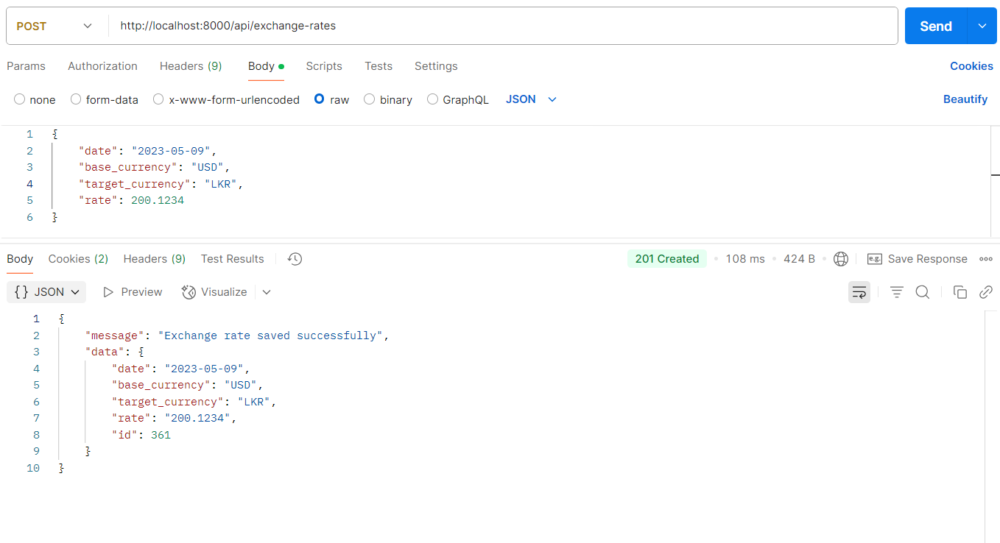
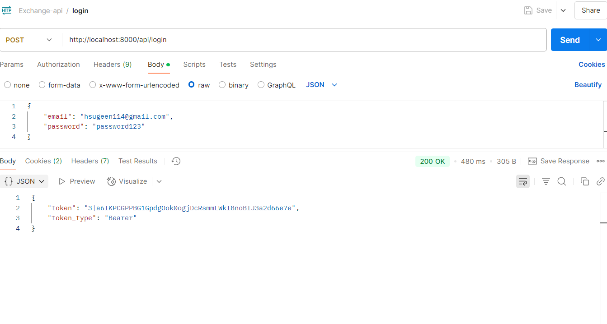

Exchange Rate API 2.0

A modern full-stack application built with Laravel 12 and Vue 3, enabling users to register, log in, and manage exchange rate entries securely. The landing page displays current exchange rates, while authenticated users can add new rates.

--------------------------------------------------------------------------------

🚀 Features
User Authentication: Register, login, and logout functionalities using Laravel Sanctum.

Protected Routes: Only authenticated users can access the exchange rate form.

RESTful API: Backend APIs for authentication and exchange rate management.

Vue 3 Frontend: Interactive UI with Vue Router and Axios.

Postman Collection: Easily test API endpoints.

--------------------------------------------------------------------------------

🛠️ Installation

Prerequisites
Ensure you have the following installed:

PHP >= 8.1

Composer

Node.js & npm

MySQL or any other supported database

1. Clone the Repository

git clone https://bitbucket.org/hariidev/exchange-api_2.0.git
cd exchange-api_2.0

2. Install PHP Dependencies

composer install

3. Install Node Dependencies

npm install

4. Environment Setup

Copy .env.example to .env:

    cp .env.example .env

5. Configure your database credentials in the .env file:

DB_CONNECTION=mysql
DB_HOST=127.0.0.1
DB_PORT=3306
DB_DATABASE=your_database_name
DB_USERNAME=your_username
DB_PASSWORD=your_password

6. Run Migrations & Seeder

php artisan migrate --seed

API Testing with Postman

A Postman collection is available to test the API endpoints.

Import the Collection

https://bitbucket.org/hariidev/exchange-api_2.0/raw/master/Exchange-api.postman_collection.json

Available Endpoints

1. Register

URL: /api/register
Method: POST

Body:

    {
    "name": "John Doe",
    "email": "john@example.com",
    "password": "password",
    "password_confirmation": "password"
    }

Response:

    {
    "message": "User registered successfully",
    "access_token": "token_value",
    "token_type": "Bearer"
    }

--------------------------------------------------------------------------------
2. Login

URL: /api/login
Method: POST

Body:

    {
    "email": "john@example.com",
    "password": "password"
    }

Response:

    {
    "token": "token_value",
    "token_type": "Bearer"
    }

--------------------------------------------------------------------------------

3. Logout

URL: /api/logout
Method: POST

Headers:

    Authorization: Bearer token_value

Response:

    {
    "message": "Logged out successfully"
    }

--------------------------------------------------------------------------------

4. Fetch Exchange Rates (index)

URL: /api/exchange-rates
Method: GET
Auth Required: ❌ No (public endpoint)

Response:

[
  {
    "id": 1,
    "date": "2025-05-10",
    "currency": "USD",
    "rate": "305.00",
    "created_at": "2025-05-10T10:00:00.000000Z",
    "updated_at": "2025-05-10T10:00:00.000000Z"
  },
  {
    "id": 2,
    "date": "2025-05-09",
    "currency": "AUD",
    "rate": "202.15",
    "created_at": "2025-05-09T10:00:00.000000Z",
    "updated_at": "2025-05-09T10:00:00.000000Z"
  }
]

5. Submit Exchange Rate

URL: /api/exchange-rates
Method: POST

Headers:

    Authorization: Bearer token_value

Body:

    {
    "date": "2025-05-10",
    "currency": "USD",
    "rate": 300.50
    }

Response:

    {
    "message": "Exchange rate submitted successfully!"
    }

-------------------------------------------------------------------------
Postman response for index()

Postman response for store() 

Postman response for register() 

Postman response for login()

Postman response after logout()

Postman response for activitylog

